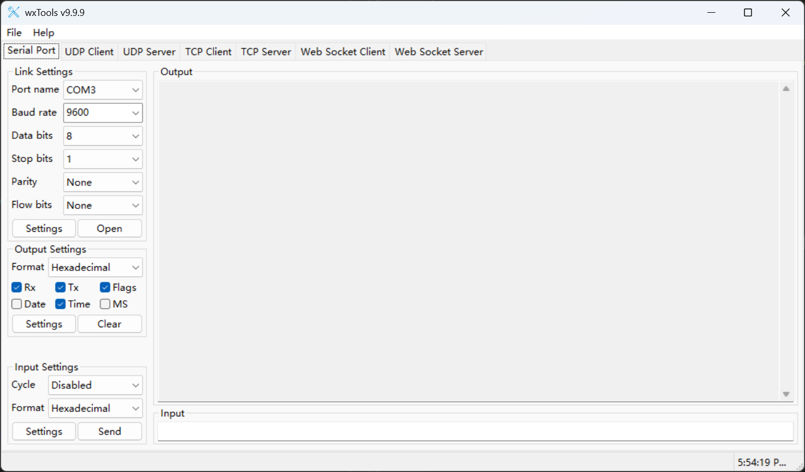
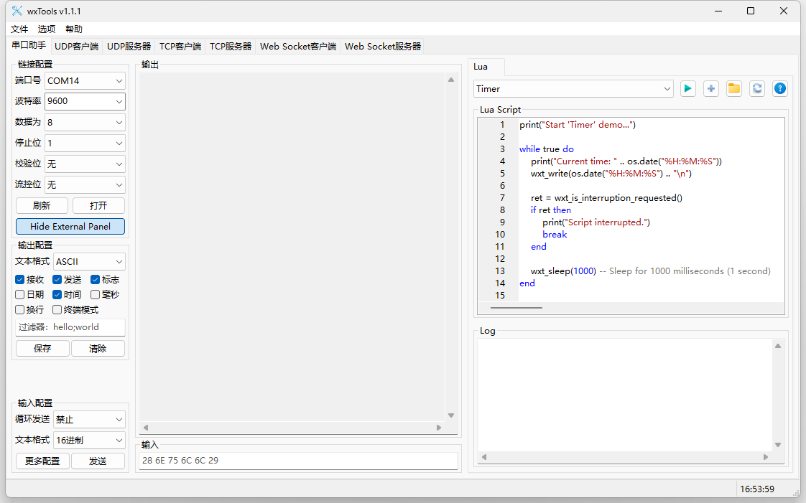

# wxTools  [](https://www.gnu.org/licenses/lgpl-3.0.html)   [](https://www.microsoft.com/store/apps/9P29H1NDNKBB) [](https://github.com/x-tools-author/wx-tools/actions/workflows/build-pages.yml)

[](https://github.com/x-tools-author/wx-tools/actions/workflows/build-windows.yml)
[](https://github.com/x-tools-author/wx-tools/actions/workflows/build-ubuntu.yml)
[](https://github.com/x-tools-author/wx-tools/actions/workflows/build-macos.yml)
[](https://github.com/x-tools-author/wx-tools/actions/workflows/build-daily.yml)
[](https://github.com/x-tools-author/wx-tools/actions/workflows/build-release.yml)

[](https://repology.org/project/wx-tools/versions)

wxTools is a user-friendly, open-source, cross-platform and expandable(using lua script) debugging tool-set based on wxWidgets (wxWidgets 3.3.x is required). It offers extensive support for SerialPort, UDP, TCP and Web Socket debugging functionalities.

> **You can get *wxTools* form [Micorsoft App Store(Sponsor)](https://www.microsoft.com/store/apps/9NX1D0CCV9T7)** or [Apple App Store(Sponsor)](https://apps.apple.com/cn/app/wxtools/id6751503985?mt=12) or from [Github Release(Community)](https://github.com/x-tools-author/wx-tools/releases).
>
> There are no differences functions between the store edition and the community edition. But the store edition is more convenient to install and update.

## Build

### Arch Linux

Arch Linux can install wx-tools via the [AUR](https://aur.archlinux.org/packages/wx-tools) or a [self-built source](https://github.com/taotieren/aur-repo).

```bash
yay -Syu wx-tools
```

### VS Code

You can use Visual Studio Code to build and debug the project. Just open project directory in VS Code. Please make sure you have installed the following software:

- CMake
- Ninja
- GCC or Visual Studio

### Ubuntu

cd to the root directory of the project, then run the following commands to build under Ubuntu 20.04 or later.

```bash
chmod +x ./scripts/install-dependencies.sh
sudo ./scripts/install-dependencies.sh
chmod +x ./scripts/ci-build-ubuntu-20.04.sh
./scripts/ci-build-ubuntu-20.04.sh
```

> The archive is output to the `./build/assets` directory. The deb file is output to the `./build/deb` directory.

## About the Project

<!--https://sdpro.top/blog/html/article/1016.html-->
[](https://img.shields.io/github/stars/x-tools-author/wx-tools?style=social)
[](https://img.shields.io/github/forks/x-tools-author/wx-tools?style=social)
[](https://img.shields.io/github/watchers/x-tools-author/wx-tools?style=social)
[](https://gitee.com/x-tools-author/wx-tools/stargazers)
[](https://gitee.com/x-tools-author/wx-tools/members)

|Option|Description|
|---|---|
|Author|x-tools-author|
|E-mail|<x-tools@outlook.com>|
|User Communication| 952218522 (QQ Group)|
|Gitee| <https://gitee.com/x-tools-author/x-tools>|
|GitHub| <https://github.com/x-tools-author/x-tools>|
|Sponsor|<https://apps.microsoft.com/search/publisher?name=x-tools-author>|
|Third party|[libmodbus](https://github.com/stephane/libmodbus) [glog](https://github.com/google/glog) [asio](https://github.com/boostorg/asio) [fmt](https://github.com/fmtlib/fmt) [json](https://github.com/nlohmann/json) [sigslot](https://github.com/palacaze/sigslot) [mongoose]( https://github.com/cesanta/mongoose) [CSerialPort](https://github.com/itas109/CSerialPort)|

## Screenshot




